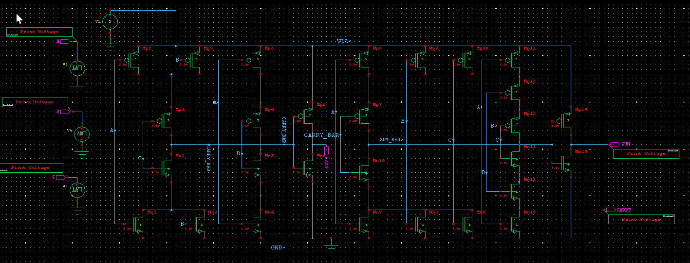
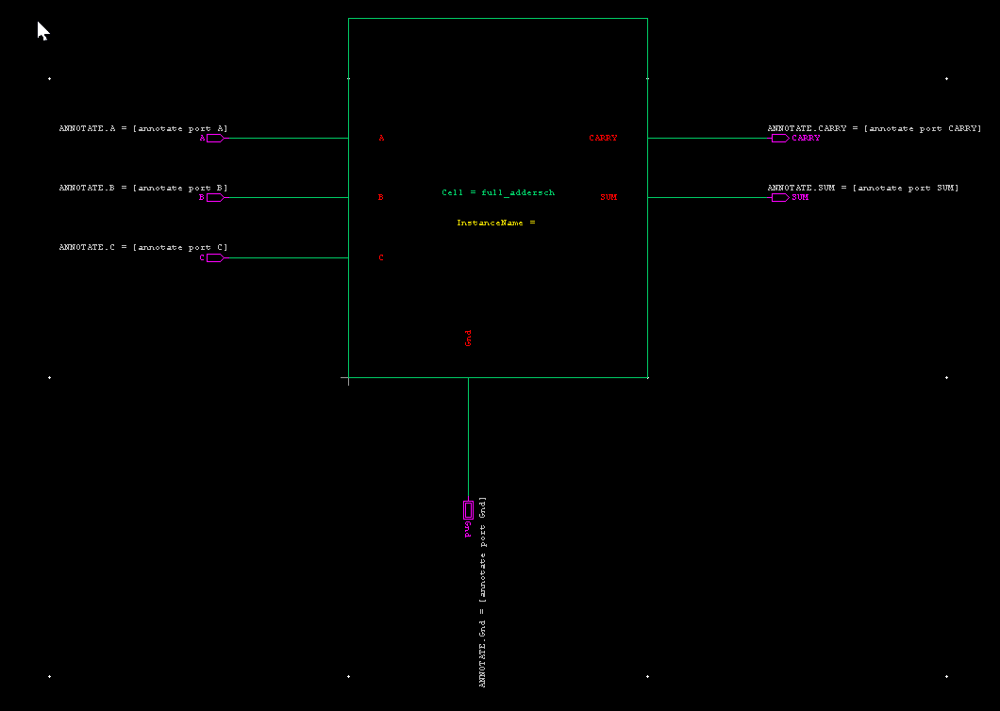
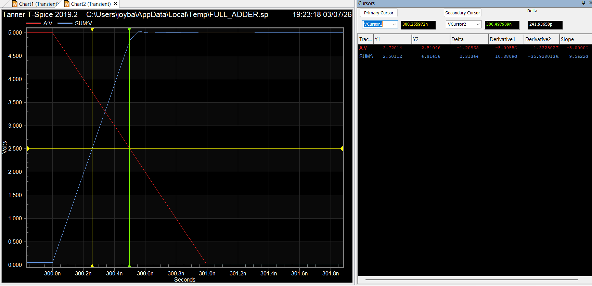
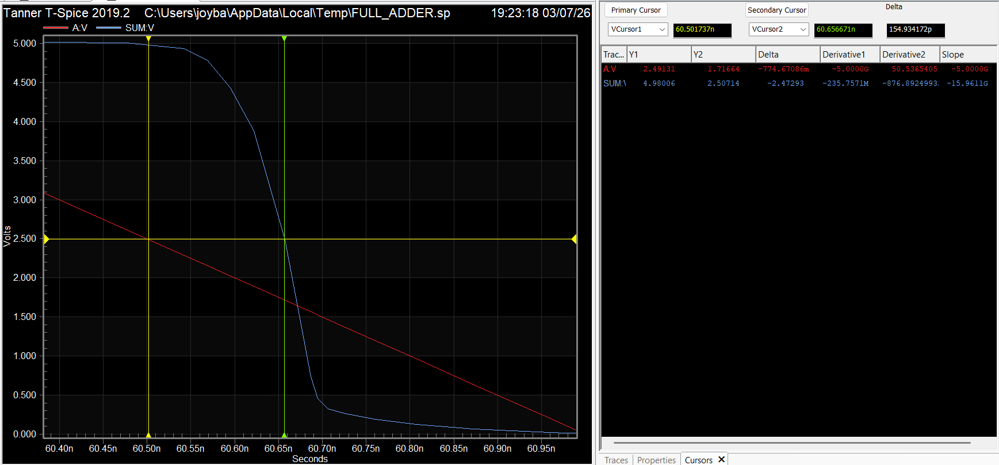
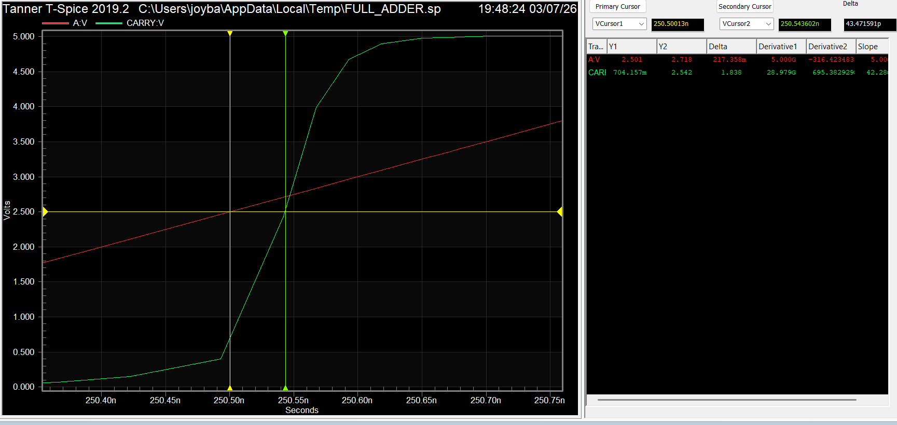
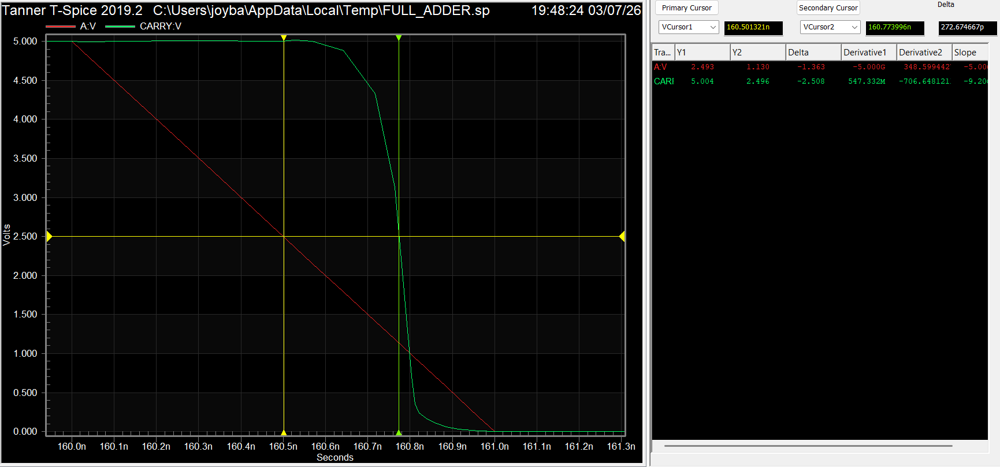
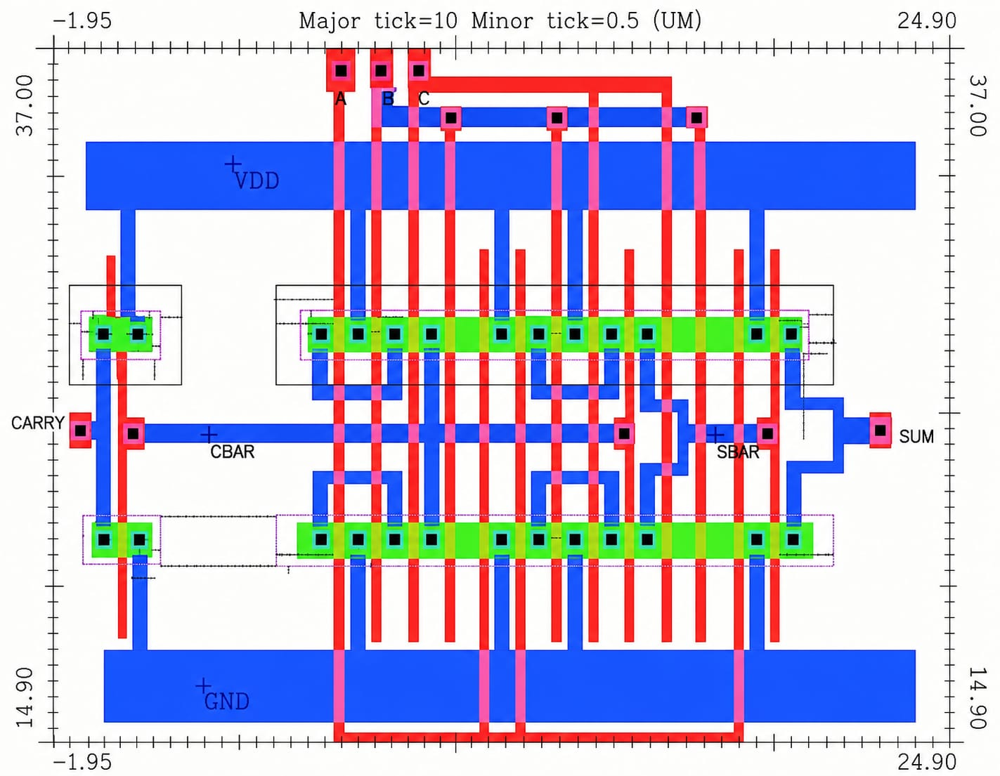
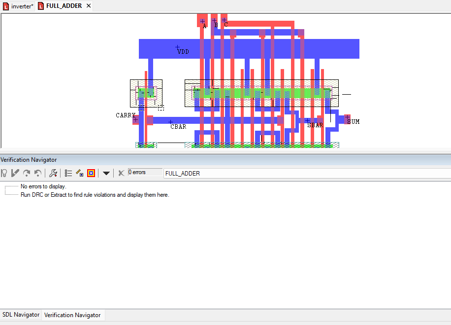

# 28T CMOS Full Adder using Static CMOS Logic

A 28-Transistor (28T) Complementary Static CMOS Full Adder is a fundamental arithmetic circuit used in digital systems. It performs the addition of three one-bit binary inputs (**A**, **B**, and **Cin**) and produces two outputs: **Sum (S)** and **Carry-out (Cout)**.

This project presents the complete design and implementation of a **28T CMOS Full Adder** using **Tanner EDA**. The design flow includes schematic creation, symbol generation, transient simulation, average power analysis, propagation delay analysis, layout implementation, and Design Rule Check (DRC) verification.

---

**Fig 1: Functional block diagram and truth table of a 1-bit Full Adder.**

---
## Full Adder Fundamentals

A **1-bit Full Adder** is a combinational logic circuit that adds three one-bit binary inputs (**A**, **B**, and **Carry-in (Cin)**) to produce two outputs: **Sum (S)** and **Carry-out (Cout)**. The output of the circuit for every possible input combination is represented by its truth table.

In digital arithmetic, the Carry output can be interpreted using the **Generate (G)**, **Propagate (P)**, and **Delete (D)** concepts. These intermediate signals depend only on the input bits **A** and **B**, simplifying the implementation of the SUM and CARRY functions and forming the basis of many arithmetic circuit designs.

---

<table align="center">
<tr>
<td align="center">

</td>

<td align="center">

</td>
</tr>
</table>

<b>Fig 2: Truth table and Generate-Propagate-Delete (G, P, D) representation of a 1-bit Full Adder.</b>

---

## 28T Static CMOS Full Adder Architecture

The **28-Transistor (28T) Complementary Static CMOS Full Adder** is designed using complementary PMOS and NMOS transistor networks to implement the **SUM** and **CARRY** logic functions. The circuit consists of **28 MOS transistors** arranged to provide full output voltage swing while ensuring correct logic operation for all possible input combinations.

The complementary static CMOS implementation offers several advantages, including **low static power dissipation**, **high noise immunity**, **strong driving capability**, and **reliable performance**. Owing to these characteristics, the 28T CMOS Full Adder is widely used as a fundamental building block in arithmetic circuits such as Ripple Carry Adders (RCA), multipliers, Arithmetic Logic Units (ALUs), and other digital VLSI systems.

---

<b>Fig 3: 28-Transistor Complementary Static CMOS Full Adder architecture.</b>

---
## Schematic Design

The schematic of the proposed **28T CMOS Full Adder** was designed using **Tanner S-Edit** in **250 nm CMOS technology**. The circuit consists of 28 MOS transistors arranged according to the complementary static CMOS architecture to implement the **SUM** and **CARRY** logic functions.

The schematic was verified through transient simulation to ensure correct functionality for all possible input combinations before proceeding to the layout design. This schematic serves as the foundation for symbol generation, simulation, and physical layout implementation.

---

<b>Fig 4: Schematic of the proposed 28T CMOS Full Adder designed using Tanner S-Edit.</b>

---
## Symbol Design

A reusable symbol of the 28T CMOS Full Adder was created in **Tanner S-Edit** to enable hierarchical circuit design. The symbol abstracts the transistor-level implementation into a functional block with three inputs (**A**, **B**, and **Cin**) and two outputs (**SUM** and **Cout**), making it convenient to integrate the Full Adder into larger digital circuits such as Ripple Carry Adders and Arithmetic Logic Units (ALUs).

---

<b>Fig 5: Symbol of the proposed 28T CMOS Full Adder.</b>

---
## Transient Simulation

The functionality of the proposed **28T CMOS Full Adder** was verified using **T-Spice transient analysis**. A sequence of input vectors was applied to the three input terminals (**A**, **B**, and **Cin**) to validate the operation of the circuit under all possible input combinations.

The simulated waveforms confirm that the **SUM** and **CARRY** outputs correctly follow the expected Full Adder truth table, demonstrating the functional correctness of the proposed design.

---

<b>Fig 6: Transient simulation waveform of the proposed 28T CMOS Full Adder.</b>

---
## Power Analysis

Power consumption is an important performance parameter in CMOS VLSI design, particularly for battery-powered and high-density integrated circuits. The average power consumed by the proposed **28T CMOS Full Adder** was evaluated using **T-Spice** by measuring the current drawn from the supply voltage during transient simulation.

The measured results provide an estimate of the circuit's power efficiency under the applied input patterns and can be used to compare the proposed design with other Full Adder architectures.

---

<b>Fig 7: power analysis of the proposed 28T CMOS Full Adder.</b>

---
## Propagation Delay Analysis

Propagation delay is a key performance parameter that determines the switching speed of a CMOS circuit. The propagation delay of the proposed **28T CMOS Full Adder** was evaluated using **T-Spice** by measuring the **low-to-high (tPLH)** and **high-to-low (tPHL)** transition delays for both the **SUM** and **CARRY** outputs.

The measured delays verify the timing performance of the proposed design and provide an estimate of its operating speed under the applied input conditions.

---

<table align="center">
<tr>
<td align="center">
 
<b>(a) SUM – tPLH</b>
</td>

<td align="center">
 
<b>(b) SUM – tPHL</b>
</td>
</tr>

<tr>
<td align="center">
 
<b>(c) CARRY – tPLH</b>
</td>

<td align="center">
 
<b>(d) CARRY – tPHL</b>
</td>
</tr>
</table>

<b>Fig 8: Propagation delay analysis of the proposed 28T CMOS Full Adder.</b>

---
## Layout Design

After functional verification and performance analysis, the physical layout of the proposed **28T CMOS Full Adder** was implemented using **Tanner L-Edit** in **250 nm CMOS technology**. The layout was created by carefully placing the PMOS and NMOS transistors and routing the interconnections while adhering to the design rules of the selected technology.

The layout accurately represents the schematic implementation and serves as the physical realization of the Full Adder. Proper routing and transistor placement were employed to ensure correct connectivity and facilitate successful design verification.

---

<b>Fig 9: Layout of the proposed 28T CMOS Full Adder.</b>

---
## Design Rule Check (DRC)

The completed layout was verified using the **Design Rule Check (DRC)** tool in **Tanner L-Edit** to ensure compliance with the technology design rules. The verification confirmed that the proposed layout is free from design rule violations, indicating that the layout is suitable for fabrication according to the selected CMOS technology.

---

<b>Fig 10: Design Rule Check (DRC) verification of the proposed 28T CMOS Full Adder.</b>

---
## Extracted Netlist

The completed layout was successfully extracted using **Tanner L-Edit**, generating an **Extracted SPICE Netlist** that preserves the physical connectivity of the implemented layout. The extracted netlist can be used for post-layout simulation and further verification of the circuit to ensure that the layout accurately represents the original schematic design.

---

<b>Fig 11: Extracted SPICE netlist generated from the layout.</b>

---
## Tools and Technology

| Parameter | Specification |
|-----------|---------------|
| Design Tool | Tanner EDA |
| Schematic Editor | Tanner S-Edit |
| Layout Editor | Tanner L-Edit |
| Simulator | T-Spice |
| Technology | Generic 250 nm CMOS |
| Supply Voltage | 3.3 V |
| Logic Style | Complementary Static CMOS |
| Number of Transistors | 28 |

---
## Conclusion

This project demonstrates the complete implementation of a **28-Transistor Complementary Static CMOS Full Adder** using **Tanner EDA** in **250 nm CMOS technology**. The design was successfully implemented from schematic capture to physical layout, followed by transient simulation, average power analysis, propagation delay measurement, layout generation, DRC verification, and extracted SPICE netlist generation.
